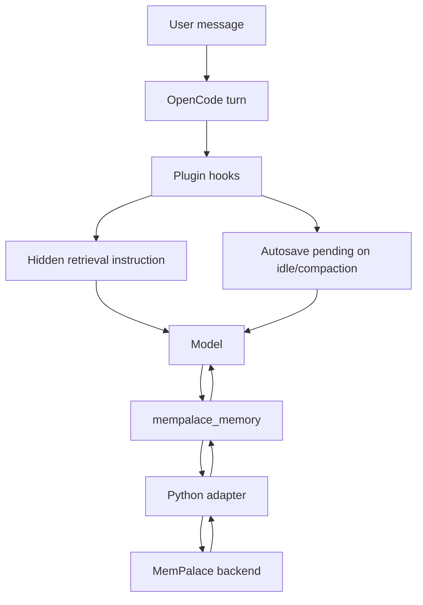

# OpenCode MemPalace Plugin

> Persistent memory for OpenCode with hidden retrieval, autosave, and a safe MemPalace wrapper tool.

[Русская версия](./README.ru.md)

OpenCode plugin for hidden retrieval and autosave with [MemPalace](https://github.com/milla-jovovich/mempalace) through a local Python adapter.

- OpenCode: https://opencode.ai
- MemPalace: https://github.com/milla-jovovich/mempalace

## What it does

- injects hidden retrieval hints before normal answers
- marks autosave on session lifecycle events
- exposes one safe memory tool: `mempalace_memory`
- routes memory through enforced user/project scopes
- applies privacy filtering before writes
- logs to both OpenCode logs and a local file

## Architecture



## Installation

Add to `opencode.json`:

```json
{
  "plugin": ["@rvboris/opencode-mempalace"]
}
```

OpenCode installs plugin dependencies automatically.

## Local development

For source loading:

```jsonc
{
  "$schema": "https://opencode.ai/config.json",
  "plugin": [
    "file:///ABSOLUTE/PATH/TO/mempalace-autosave/plugin/index.ts"
  ]
}
```

The plugin itself does not require the MemPalace MCP server. It uses the bundled Python adapter.

## Prerequisites

- Python 3.9+
- MemPalace installed and initialized

```bash
pip install mempalace
mempalace init <dir>
mempalace mine <dir>
```

## Build

```bash
npm run build
```

This builds TypeScript into `dist/` and copies the adapter to `dist/bridge/`.

## Configuration

Environment variables:

- `MEMPALACE_AUTOSAVE_ENABLED`
- `MEMPALACE_RETRIEVAL_ENABLED`
- `MEMPALACE_KEYWORD_SAVE_ENABLED`
- `MEMPALACE_PRIVACY_REDACTION_ENABLED`
- `MEMPALACE_MAX_INJECTED_ITEMS`
- `MEMPALACE_RETRIEVAL_QUERY_LIMIT`
- `MEMPALACE_AUTOSAVE_LOG_FILE`
- `MEMPALACE_ADAPTER_PYTHON`
- `MEMPALACE_USER_WING_PREFIX`
- `MEMPALACE_PROJECT_WING_PREFIX`

Optional config file: `~/.config/opencode/mempalace.jsonc`

```jsonc
{
  "autosaveEnabled": true,
  "retrievalEnabled": true,
  "keywordSaveEnabled": true,
  "maxInjectedItems": 6,
  "retrievalQueryLimit": 5,
  "keywordPatterns": ["remember", "save this", "don't forget", "note that"],
  "privacyRedactionEnabled": true,
  "userWingPrefix": "wing_user",
  "projectWingPrefix": "wing_project"
}
```

## Runtime behavior

### Retrieval

On normal user turns the plugin can inject hidden retrieval guidance so the model searches existing memory before answering.

### Autosave

On `session.idle` and `session.compacted`, the plugin marks autosave as pending. The actual write happens on the next model turn through `mempalace_memory`.

### Safe wrapper tool

The model should use only:

- `mempalace_memory`

Direct mutation tools are blocked:

- `mempalace_add_drawer`
- `mempalace_kg_add`
- `mempalace_diary_write`
- matching `mcp-router_*` variants

## Scope policy

### User scope

- wing: `${MEMPALACE_USER_WING_PREFIX}_profile`
- rooms: `preferences`, `workflow`, `communication`

Use for:
- response preferences
- personal workflow habits
- cross-project conventions

### Project scope

- wing: `${MEMPALACE_PROJECT_WING_PREFIX}_${slug(projectName)}`
- rooms: `architecture`, `workflow`, `decisions`, `bugs`, `setup`

Use for:
- repo-specific setup
- architecture decisions
- build/test commands
- bug/solution patterns

## Examples

### Save a user preference

```text
mempalace_memory
  mode: save
  scope: user
  room: preferences
  content: Prefers concise responses and numbered steps.
```

### Save a project decision

```text
mempalace_memory
  mode: save
  scope: project
  room: decisions
  content: Use Bun for builds and tests; avoid npm.
```

### Add KG fact

```text
mempalace_memory
  mode: kg_add
  scope: project
  subject: my-repo
  predicate: uses
  object: bun
```

### Search memory

```text
mempalace_memory
  mode: search
  scope: user
  room: preferences
  query: user name
  limit: 3
```

## Privacy

- supports `<private>...</private>` blocks
- redacts common secrets before writes
- refuses to save fully private content

## Logging

Logs are written to:

- OpenCode built-in logger
- file log: `~/.mempalace/opencode_autosave.log`

For debugging:

```bash
opencode --log-level DEBUG
```

## Notes

- no visible autosave chat messages
- no OpenCode tool-to-tool calls
- adapter uses stdin/stdout streaming
- package is publishable as a standard OpenCode plugin
