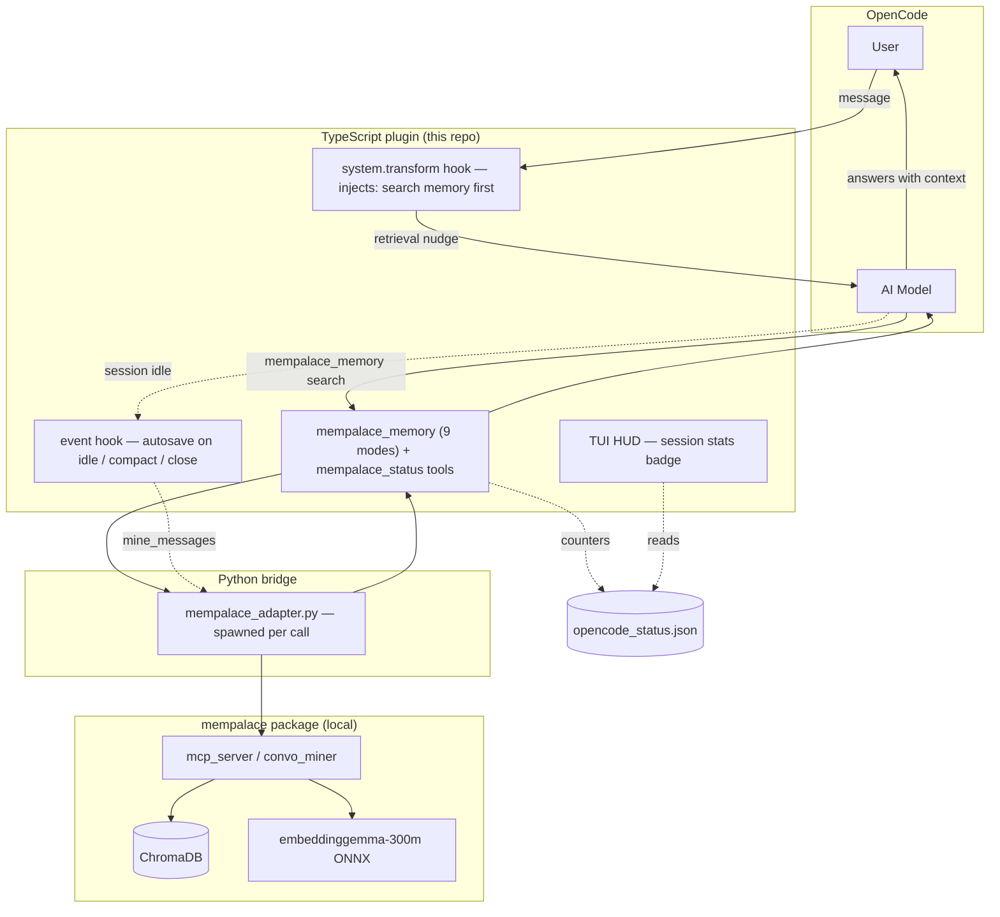

# @rvboris/opencode-mempalace

**Persistent memory for OpenCode — zero config, visible results.**

Your AI coding assistant forgets everything between sessions. This plugin fixes that. It silently saves what matters and finds it when needed — no extra prompts, no manual effort.

[Русская версия](./README.ru.md)

---

## What it does

Before every reply, the plugin searches your memory for relevant context. After every session, it quietly saves durable knowledge. You never have to say "remember this" — but when you do, it listens.

```
You: "What build tool does this project use?"
AI:  [searches memory] → "Bun. This project uses Bun."
```

### The result

- Answers informed by your past decisions, preferences, and project history
- No repeated explanations across sessions
- Privacy-first: secrets and private blocks are never stored
- Works entirely locally — no cloud, no API keys, no MCP server

## Quick start

**Prerequisites:** [OpenCode](https://opencode.ai) and Python 3.10+ with pip.

```bash
pip install mempalace
mempalace init ~/.mempalace/palace
```

Add to `opencode.json`:

```json
{
  "plugin": ["@rvboris/opencode-mempalace"]
}
```

That's it. Memory search, autosave, and both tools are active immediately.

## How it works

The plugin runs inside OpenCode as hooks + tools. A thin Python bridge calls the local `mempalace` package, which stores everything in ChromaDB with on-device `embeddinggemma-300m` embeddings. No cloud, no API keys.



**Retrieval** — before each reply, the `system.transform` hook nudges the model to search memory first. The model calls `mempalace_memory [search]`, the bridge forwards it to `mempalace`, and results (vector + BM25) come back as context for the answer.

**Autosave** — on session idle, compaction, or close, the `event` hook mines the transcript for durable facts and saves them to the right memory area via `mine_messages`. Counters are written to `opencode_status.json`, which the TUI HUD reads.

**Keyword save** — when the user says "remember this" / "note that", the plugin arms a save instruction so the model persists the fact immediately via `mempalace_memory [save]`.

The plugin talks to `mempalace` through a local Python bridge (`bridge/mempalace_adapter.py`), spawned per call — it does **not** require the MemPalace MCP server.

## Features

### Hidden retrieval

Before each answer, the plugin injects a search instruction so the model checks your memory first. No tool call noise in the chat — the context just appears.

### Background autosave

On session idle, compaction, or close, the plugin mines the conversation transcript for durable facts and saves them to the right memory area automatically. Low-signal fragments are filtered before mining, so prompt leftovers like `re.`, `ls>`, or mostly punctuation are skipped instead of becoming junk memory.

### Reliable local bridge

Write-like operations (`save`, autosave mining, diary writes, graph writes, checkpoints, deletes) are serialized through the adapter and retried on MemPalace palace-lock contention (`held by PID`). Search calls still run without that write queue.

### `mempalace_memory` — the one tool

Nine modes, one interface:

| Mode | Purpose |
|---|---|
| `save` | Store a preference, fact, or decision |
| `search` | Find relevant memory by query (optional `source_file` filter) |
| `kg_add` | Add a structured fact to the knowledge graph |
| `diary_write` | Save a short work note |
| `checkpoint` | Batch-save multiple items + optional diary in one call |
| `delete` | Remove a memory by drawer ID |
| `delete_by_source` | Bulk-remove memories by source file (dry-run by default) |
| `kg_query` | Search the knowledge graph for an entity's relationships |
| `diary_read` | Read recent diary entries |

Examples:

```text
mempalace_memory  mode: save  scope: user  room: preferences  content: Prefers concise responses.
```

```text
mempalace_memory  mode: search  scope: project  room: decisions  query: build tool
```

```text
mempalace_memory  mode: kg_add  subject: my-repo  predicate: uses  object: bun
```

```text
mempalace_memory  mode: checkpoint  items: [{"wing":"wing_user","room":"preferences","content":"likes dark mode"},{"wing":"wing_project","room":"decisions","content":"uses bun"}]
```

```text
mempalace_memory  mode: delete_by_source  source_file: /data/import.jsonl  dry_run: true
```

### `mempalace_status` — visible proof

Check whether the plugin is actually helping:

```text
mempalace_status
```

Shows retrieval hit rate, last autosave outcome, memory previews, and cumulative counters. Use `verbose: true` for full detail.

### TUI HUD — memory stats in your prompt

A compact session stats line appears in the OpenCode prompt area:

```
MEM helps 3
MEM cited 2
MEM found 5
MEM no hits
MEM searched
MEM quiet
MEM helps 1 · fail 1
```

- `MEM helps N` — memory improved or saved time (the most useful verdicts)
- `MEM cited N` — memory was mentioned but did not change the answer
- `MEM no help` — retrieval happened but had no effect
- `MEM unknown` — model omitted the verdict tag
- `MEM found N` — retrieval returned N memories and no judge verdict is recorded yet
- `MEM no hits` — retrieval ran and returned no memories
- `MEM searched` — retrieval ran, but result count is unavailable
- `MEM quiet` — no retrieval activity yet
- `· fail N` / `· skip N` — shown only when autosave has errors

The HUD combines retrieval evidence with a **judge signal**. When the model reports `[memory: verdict]`, the plugin parses it after each turn and strips it before saving. If no verdict is available, retrieval results still show as `found`, `no hits`, or `searched`. Requires a `tui.json` entry (see below).

## Memory areas

**User memory** — cross-project preferences and habits:

- `preferences` — coding style, communication preferences
- `workflow` — working patterns, tool choices
- `communication` — language, response format

**Project memory** — repository-specific knowledge:

- `architecture` — design decisions, patterns
- `workflow` — build commands, CI config
- `decisions` — ADRs, trade-offs
- `bugs` — known issues, workarounds
- `setup` — environment setup, dependencies

## Privacy

- `<private>...</private>` blocks are respected and never stored
- Common secrets (API keys, tokens, passwords) are redacted before writes
- Fully private content is skipped entirely

## Configuration

Optional config file at `~/.config/opencode/mempalace.jsonc`:

```jsonc
{
  "autosaveEnabled": true,
  "retrievalEnabled": true,
  "keywordSaveEnabled": true,
  "maxInjectedItems": 6,
  "retrievalQueryLimit": 5,
  "privacyRedactionEnabled": true
}
```

Environment variables:

| Variable | Purpose |
|---|---|
| `MEMPALACE_AUTOSAVE_ENABLED` | Toggle background autosave |
| `MEMPALACE_RETRIEVAL_ENABLED` | Toggle hidden retrieval |
| `MEMPALACE_KEYWORD_SAVE_ENABLED` | Toggle keyword-triggered saves |
| `MEMPALACE_PRIVACY_REDACTION_ENABLED` | Toggle secret redaction |
| `MEMPALACE_ADAPTER_PYTHON` | Path to Python binary |
| `MEMPALACE_ADAPTER_TIMEOUT_MS` | Adapter timeout (default 15000) |

## TUI HUD setup

To enable the prompt-area stats display, add a `tui.json` in your OpenCode config directory:

```json
{
  "$schema": "https://opencode.ai/tui.json",
  "plugin": [
    "file:///path/to/opencode-mempalace/plugin/tui/index.tsx"
  ]
}
```

Or when installed from npm, use the package entry:

```json
{
  "$schema": "https://opencode.ai/tui.json",
  "plugin": ["@rvboris/opencode-mempalace/tui"]
}
```

## Compatibility

| Requirement | Version |
|---|---|
| OpenCode | latest |
| Python | 3.10+ |
| MemPalace | 3.3+ |
| OS | macOS, Linux, Windows |

## Project docs

- [Changelog](./CHANGELOG.md) — release notes
- [Contributing](./CONTRIBUTING.md) — changelog rules

## Local development

```bash
git clone https://github.com/rvboris/opencode-mempalace.git
cd opencode-mempalace
npm install
npm run build
```

Load from source in `opencode.json`:

```jsonc
{
  "plugin": ["file:///ABSOLUTE/PATH/TO/opencode-mempalace/plugin/index.ts"]
}
```

Debug: `opencode --log-level DEBUG` or check `~/.mempalace/opencode_autosave.log`.

## Links

- OpenCode: https://opencode.ai
- MemPalace: https://github.com/milla-jovovich/mempalace
- npm: https://www.npmjs.com/package/@rvboris/opencode-mempalace

## License

MIT
