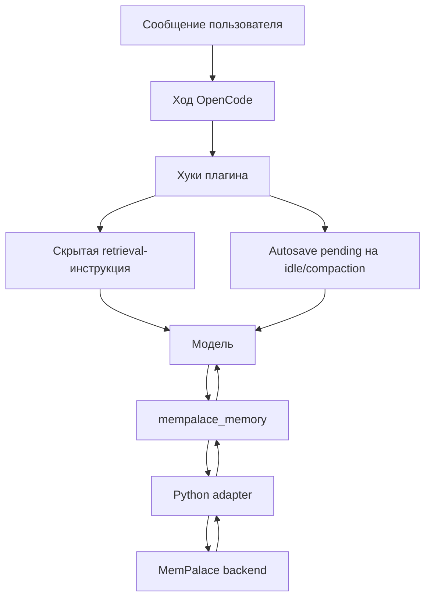

# Плагин MemPalace для OpenCode

> Постоянная память для OpenCode: скрытый retrieval, autosave и безопасный wrapper tool для MemPalace.

[English version](./README.md)

Плагин для [OpenCode](https://opencode.ai) со скрытым retrieval и autosave в [MemPalace](https://github.com/milla-jovovich/mempalace) через локальный Python adapter.

- OpenCode: https://opencode.ai
- MemPalace: https://github.com/milla-jovovich/mempalace

## Что делает

- добавляет скрытые подсказки для retrieval перед обычным ответом
- помечает autosave на событиях жизненного цикла сессии
- дает один безопасный tool: `mempalace_memory`
- направляет память в user/project scope по явным правилам
- применяет privacy-фильтрацию перед записью
- пишет логи в OpenCode и в локальный файл

## Схема работы



## Установка

Добавь в `opencode.json`:

```json
{
  "plugin": ["@rvboris/opencode-mempalace"]
}
```

OpenCode сам установит зависимости плагина при запуске.

## Локальная разработка

Для загрузки из исходников:

```jsonc
{
  "$schema": "https://opencode.ai/config.json",
  "plugin": [
    "file:///ABSOLUTE/PATH/TO/mempalace-autosave/plugin/index.ts"
  ]
}
```

Самому плагину MemPalace MCP server не нужен — он использует встроенный Python adapter.

## Требования

- Python 3.9+
- установлен и инициализирован MemPalace

```bash
pip install mempalace
mempalace init <dir>
mempalace mine <dir>
```

## Сборка

```bash
npm run build
```

Команда компилирует TypeScript в `dist/` и копирует adapter в `dist/bridge/`.

## Конфигурация

Переменные окружения:

- `MEMPALACE_AUTOSAVE_ENABLED`
- `MEMPALACE_RETRIEVAL_ENABLED`
- `MEMPALACE_KEYWORD_SAVE_ENABLED`
- `MEMPALACE_PRIVACY_REDACTION_ENABLED`
- `MEMPALACE_MAX_INJECTED_ITEMS`
- `MEMPALACE_RETRIEVAL_QUERY_LIMIT`
- `MEMPALACE_AUTOSAVE_LOG_FILE`
- `MEMPALACE_ADAPTER_PYTHON`
- `MEMPALACE_USER_WING_PREFIX`
- `MEMPALACE_PROJECT_WING_PREFIX`

Дополнительно можно использовать файл `~/.config/opencode/mempalace.jsonc`:

```jsonc
{
  "autosaveEnabled": true,
  "retrievalEnabled": true,
  "keywordSaveEnabled": true,
  "maxInjectedItems": 6,
  "retrievalQueryLimit": 5,
  "keywordPatterns": ["remember", "save this", "don't forget", "note that"],
  "privacyRedactionEnabled": true,
  "userWingPrefix": "wing_user",
  "projectWingPrefix": "wing_project"
}
```

## Как работает во время сессии

### Retrieval

На обычных пользовательских ходах плагин может подмешивать скрытую retrieval-инструкцию, чтобы модель сначала поискала релевантную память.

### Autosave

На `session.idle` и `session.compacted` плагин ставит autosave в состояние `pending`. Реальная запись делается на следующем ходе модели через `mempalace_memory`.

### Безопасный wrapper tool

Модель должна использовать только:

- `mempalace_memory`

Прямые mutating tools блокируются:

- `mempalace_add_drawer`
- `mempalace_kg_add`
- `mempalace_diary_write`
- соответствующие `mcp-router_*` варианты

## Политика scope

### User scope

- wing: `${MEMPALACE_USER_WING_PREFIX}_profile`
- rooms: `preferences`, `workflow`, `communication`

Используется для:
- предпочтений по ответам
- личных привычек работы
- кросс-проектных соглашений

### Project scope

- wing: `${MEMPALACE_PROJECT_WING_PREFIX}_${slug(projectName)}`
- rooms: `architecture`, `workflow`, `decisions`, `bugs`, `setup`

Используется для:
- repo-specific setup
- архитектурных решений
- build/test команд
- паттернов баг/решение

## Примеры

### Сохранить user preference

```text
mempalace_memory
  mode: save
  scope: user
  room: preferences
  content: Prefers concise responses and numbered steps.
```

### Сохранить project decision

```text
mempalace_memory
  mode: save
  scope: project
  room: decisions
  content: Use Bun for builds and tests; avoid npm.
```

### Добавить KG факт

```text
mempalace_memory
  mode: kg_add
  scope: project
  subject: my-repo
  predicate: uses
  object: bun
```

### Поиск в памяти

```text
mempalace_memory
  mode: search
  scope: user
  room: preferences
  query: user name
  limit: 3
```

## Privacy

- поддерживаются блоки `<private>...</private>`
- common secrets редактируются перед записью
- полностью private content не сохраняется

## Логи

Логи пишутся в:

- встроенный лог OpenCode
- файл: `~/.mempalace/opencode_autosave.log`

Для отладки:

```bash
opencode --log-level DEBUG
```

## Заметки

- никаких видимых autosave-сообщений в чате
- никаких OpenCode tool-to-tool вызовов
- adapter использует stdin/stdout streaming
- пакет подготовлен как полноценный publishable OpenCode plugin
