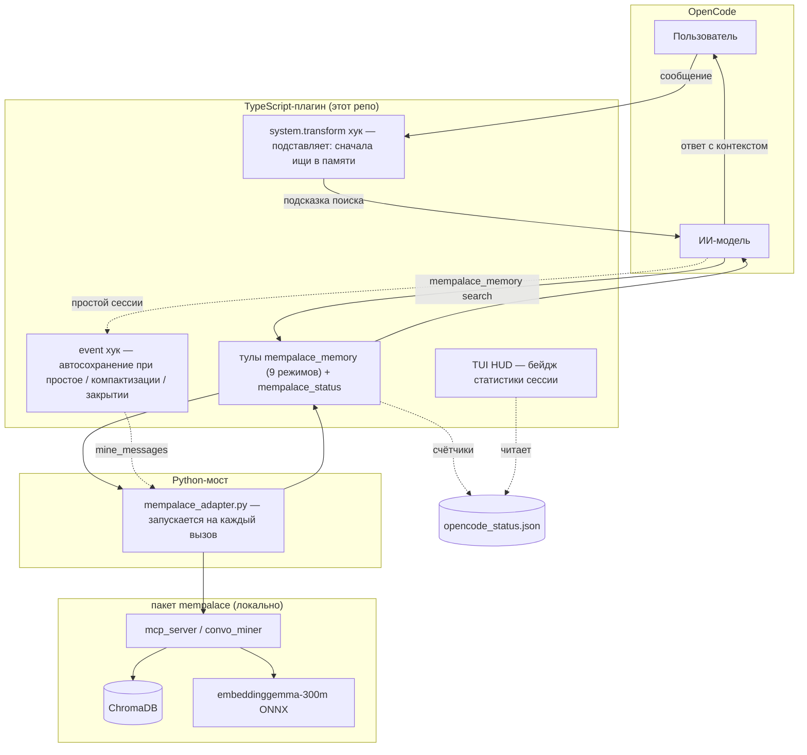

# @rvboris/opencode-mempalace

**Персистентная память для OpenCode — нулевая конфигурация, видимый результат.**

Твой ИИ-ассистент забывает всё между сессиями. Этот плагин это исправляет. Он незаметно сохраняет важное и находит его, когда нужно — без лишних подсказок и ручной работы.

[English version](./README.md)

---

## Что он делает

Перед каждым ответом плагин ищет в памяти релевантный контекст. После каждой сессии — тихо сохраняет устойчивые знания. Тебе не нужно говорить «запомни это» — но если скажешь, плагин услышит.

```
Ты: "Какую систему сборки мы используем?"
ИИ:  [ищет в памяти] → "Bun. Этот проект использует Bun."
```

### Результат

- Ответы, опирающиеся на прошлые решения, предпочтения и историю проекта
- Не нужно повторять объяснения от сессии к сессии
- Приватность: секреты и приватные блоки никогда не сохраняются
- Работает полностью локально — без облака, API-ключей и MCP-сервера

## Быстрый старт

**Требования:** [OpenCode](https://opencode.ai) и Python 3.10+ с pip.

```bash
pip install mempalace
mempalace init ~/.mempalace/palace
```

Добавь в `opencode.json`:

```json
{
  "plugin": ["@rvboris/opencode-mempalace"]
}
```

Готово. Поиск по памяти, автосохранение и оба инструмента активны сразу.

## Как это работает

Плагин работает внутри OpenCode как набор хуков и тулов. Тонкий Python-мост вызывает локальный пакет `mempalace`, который хранит всё в ChromaDB с локальными эмбеддингами `embeddinggemma-300m` на устройстве. Без облака, без API-ключей.



**Поиск (retrieval)** — перед каждым ответом хук `system.transform` подталкивает модель сначала проверить память. Модель вызывает `mempalace_memory [search]`, мост прокидывает вызов в `mempalace`, результаты (векторный + BM25-поиск) возвращаются как контекст для ответа.

**Автосохранение** — при простое сессии, компактизации или закрытии хук `event` анализирует транскрипт, извлекает устойчивые факты и сохраняет их в нужную область памяти через `mine_messages`. Счётчики пишутся в `opencode_status.json`, который читает TUI HUD.

**Сохранение по ключевому слову** — когда пользователь говорит «запомни это» / «отметь», плагин активирует инструкцию сохранения, чтобы модель сразу сохранила факт через `mempalace_memory [save]`.

Плагин обращается к `mempalace` через локальный Python-мост (`bridge/mempalace_adapter.py`), запускаемый на каждый вызов, — MCP-сервер MemPalace ему **не нужен**.

## Возможности

### Скрытый поиск

Перед каждым ответом плагин подставляет инструкцию «сначала проверь память». Модель видит релевантный контекст без лишнего шума в чате.

### Фоновое автосохранение

При простое сессии, компактизации или завершении — плагин анализирует транскрипт, извлекает устойчивые факты и сохраняет их в нужную область памяти. Низкосигнальные фрагменты фильтруются до майнинга, поэтому остатки вроде `re.`, `ls>` или почти одна пунктуация не становятся мусорной памятью.

### Надёжный локальный мост

Операции записи (`save`, автосохранение, diary, граф, checkpoints, удаления) проходят через очередь адаптера и повторяются при конфликте palace-lock (`held by PID`). Поиск выполняется без этой очереди.

### `mempalace_memory` — единый инструмент

Девять режимов, один интерфейс:

| Режим | Назначение |
|---|---|
| `save` | Сохранить предпочтение, факт или решение |
| `search` | Найти релевантную память по запросу (опциональный фильтр `source_file`) |
| `kg_add` | Добавить структурированный факт в граф знаний |
| `diary_write` | Записать короткую рабочую заметку |
| `checkpoint` | Пакетное сохранение нескольких записей + опциональной diary за один вызов |
| `delete` | Удалить память по ID записи |
| `delete_by_source` | Массовое удаление памяти по файлу-источнику (dry-run по умолчанию) |
| `kg_query` | Поиск по графу знаний — связи сущности |
| `diary_read` | Чтение недавних записей diary |

Примеры:

```text
mempalace_memory  mode: save  scope: user  room: preferences  content: Предпочитает краткие ответы.
```

```text
mempalace_memory  mode: search  scope: project  room: decisions  query: система сборки
```

```text
mempalace_memory  mode: kg_add  subject: my-repo  predicate: uses  object: bun
```

```text
mempalace_memory  mode: checkpoint  items: [{"wing":"wing_user","room":"preferences","content":"любит тёмную тему"},{"wing":"wing_project","room":"decisions","content":"использует bun"}]
```

```text
mempalace_memory  mode: delete_by_source  source_file: /data/import.jsonl  dry_run: true
```

### `mempalace_status` — видимое доказательство

Проверь, реально ли плагин помогает:

```text
mempalace_status
```

Показывает процент попаданий при поиске, последний результат автосохранения, превью памяти и накопительные счётчики. Для полного отчёта — `verbose: true`.

### TUI HUD — статистика памяти в строке промпта

Компактная строка статистики текущей сессии в области ввода OpenCode:

```
MEM helps 3
MEM cited 2
MEM found 5
MEM no hits
MEM searched
MEM quiet
MEM helps 1 · fail 1
```

- `MEM helps N` — память улучшила ответ или сэкономила время (самые полезные вердикты)
- `MEM cited N` — память была упомянута, но ответ не изменился
- `MEM no help` — поиск был, но без эффекта
- `MEM unknown` — модель не поставила тег с вердиктом
- `MEM found N` — поиск вернул N записей, но judge-вердикт ещё не записан
- `MEM no hits` — поиск был, но ничего не нашёл
- `MEM searched` — поиск был, но количество результатов недоступно
- `MEM quiet` — поиск по памяти ещё не выполнялся
- `· fail N` / `· skip N` — показываются только при ошибках автосохранения

HUD совмещает факт поиска и **judge-сигнал**. Когда модель сообщает `[memory: verdict]`, плагин парсит тег после хода и вырезает перед сохранением. Если вердикта нет, результаты поиска всё равно видны как `found`, `no hits` или `searched`. Требует записи в `tui.json` (см. ниже).

## Области памяти

**Память пользователя** — кросс-проектные предпочтения и привычки:

- `preferences` — стиль кода, предпочтения общения
- `workflow` — рабочие паттерны, выбор инструментов
- `communication` — язык, формат ответов

**Память проекта** — знания, привязанные к репозиторию:

- `architecture` — архитектурные решения, паттерны
- `workflow` — команды сборки, CI-конфиг
- `decisions` — ADR, компромиссы
- `bugs` — известные баги, обходные пути
- `setup` — настройка окружения, зависимости

## Приватность

- Блоки `<private>...</private>` уважаются и никогда не сохраняются
- Типовые секреты (API-ключи, токены, пароли) скрываются перед записью
- Полностью приватное содержимое пропускается целиком

## Настройка

Необязательный файл конфигурации: `~/.config/opencode/mempalace.jsonc`

```jsonc
{
  "autosaveEnabled": true,
  "retrievalEnabled": true,
  "keywordSaveEnabled": true,
  "maxInjectedItems": 6,
  "retrievalQueryLimit": 5,
  "privacyRedactionEnabled": true
}
```

Переменные окружения:

| Переменная | Назначение |
|---|---|
| `MEMPALACE_AUTOSAVE_ENABLED` | Включить/выключить фоновое автосохранение |
| `MEMPALACE_RETRIEVAL_ENABLED` | Включить/выключить скрытый поиск |
| `MEMPALACE_KEYWORD_SAVE_ENABLED` | Включить/выключить сохранение по ключевым словам |
| `MEMPALACE_PRIVACY_REDACTION_ENABLED` | Включить/выключить скрытие секретов |
| `MEMPALACE_ADAPTER_PYTHON` | Путь к бинарнику Python |
| `MEMPALACE_ADAPTER_TIMEOUT_MS` | Таймаут адаптера (по умолчанию 15000) |

## Настройка TUI HUD

Чтобы включить отображение статистики в строке промпта, добавь `tui.json` в каталог конфигурации OpenCode:

```json
{
  "$schema": "https://opencode.ai/tui.json",
  "plugin": [
    "file:///путь/до/opencode-mempalace/plugin/tui/index.tsx"
  ]
}
```

Или при установке из npm — используй пакетный вход:

```json
{
  "$schema": "https://opencode.ai/tui.json",
  "plugin": ["@rvboris/opencode-mempalace/tui"]
}
```

## Совместимость

| Требование | Версия |
|---|---|
| OpenCode | latest |
| Python | 3.10+ |
| MemPalace | 3.3+ |
| ОС | macOS, Linux, Windows |

## Документация проекта

- [Changelog](./CHANGELOG.md) — заметки к релизам
- [Contributing](./CONTRIBUTING.md) — правила ведения changelog

## Локальная разработка

```bash
git clone https://github.com/rvboris/opencode-mempalace.git
cd opencode-mempalace
npm install
npm run build
```

Загрузка из исходников в `opencode.json`:

```jsonc
{
  "plugin": ["file:///ABSOLUTE/PATH/TO/opencode-mempalace/plugin/index.ts"]
}
```

Отладка: `opencode --log-level DEBUG` или файл `~/.mempalace/opencode_autosave.log`.

## Ссылки

- OpenCode: https://opencode.ai
- MemPalace: https://github.com/milla-jovovich/mempalace
- npm: https://www.npmjs.com/package/@rvboris/opencode-mempalace

## Лицензия

MIT
